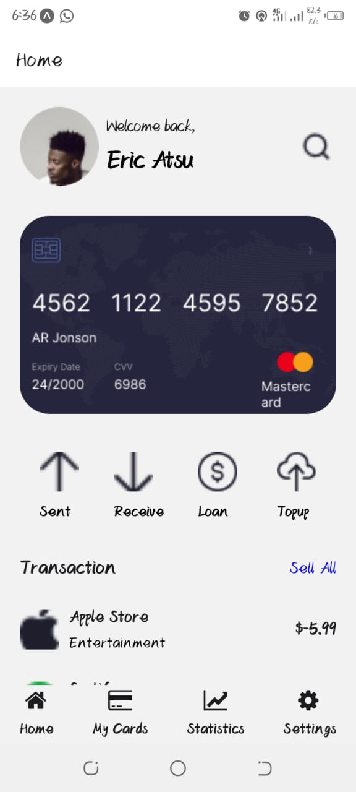

# rn-assignment5-11126606
## ID-11126606

## How It Works

### Transaction Management
The app allows users to track income and expenses through categorized transactions. Each transaction is displayed with details such as the name, category, and amount.

### Profile Settings
Users can update their profile information and manage preferences directly within the app. This feature enables customization for a personalized user experience.

### Theme Customization
The app supports both light and dark themes to cater to user preferences. The interface dynamically adjusts based on the selected theme for enhanced visibility and comfort.

## Screenshots

## Technologies Used

- **React Native:** Cross-platform mobile development with native performance.
- **React Navigation:** Seamless navigation within the app.
- **React Native Elements:** A collection of high-quality UI components for React Native.
- **React Native Vector Icons:** A collection of high-quality vector icons for React Native.
- **StyleSheet:** Styling components for a cohesive user interface.
